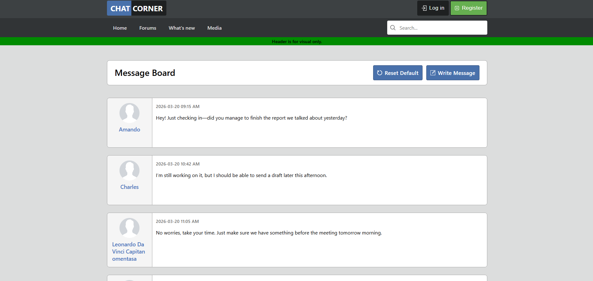
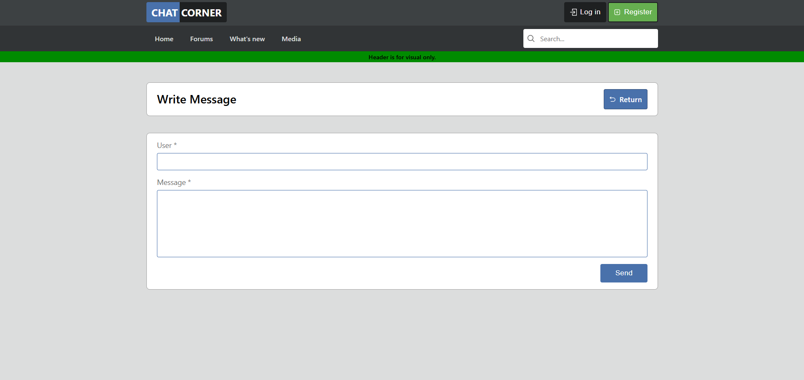

# Mini Message Board

A simple full-stack message board application built as part of **The Odin Project** Node.js course (Express section). Users can view all posted messages and easily add new ones through a clean form. Messages are stored persistently in a PostgreSQL database.

## ✨ Features

- **View Messages** – Displays a list of messages with username, timestamp, and content in a clean forum-style layout.
- **Post New Messages** – Simple form to submit a username and message text (accessed via the "Write Message" button).
- **Persistent Storage** – All messages are saved in PostgreSQL (`user_messages` table) so they survive server restarts.
- **Responsive & Clean UI** – Modern message board design with timestamps in ISO format.

## 🛠️ Technologies Used

- **Backend**: Node.js + Express.js
- **Database**: PostgreSQL
- **Templating**: EJS (server-side rendered views)
- **Other**: `express-validator` (optional), `dotenv`, `pg` (PostgreSQL driver)

This project covers the following topics from **The Odin Project Node.js Course**:

- Introduction to the Back End
- Introduction to Express
- Routes & Controllers
- Views
- Project: Mini Message Board

## 📸 Screenshots

**Main Message Board**  

**Write Message Form**  

